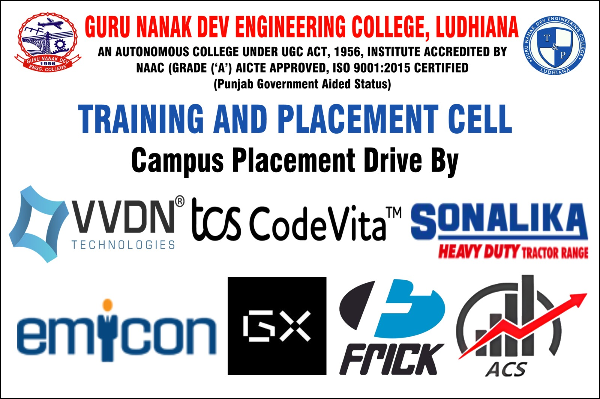
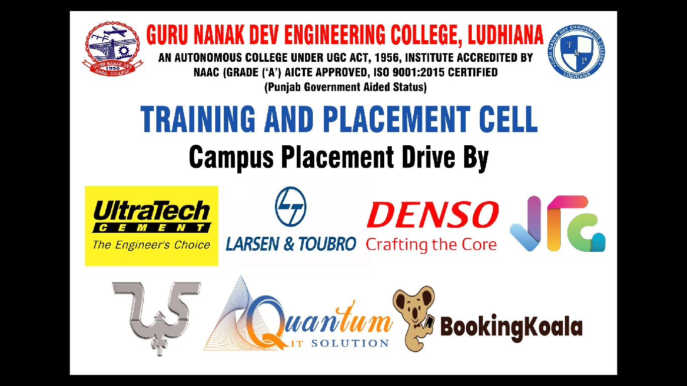
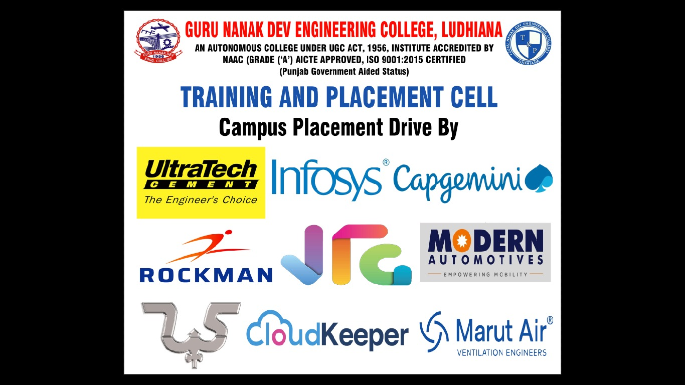
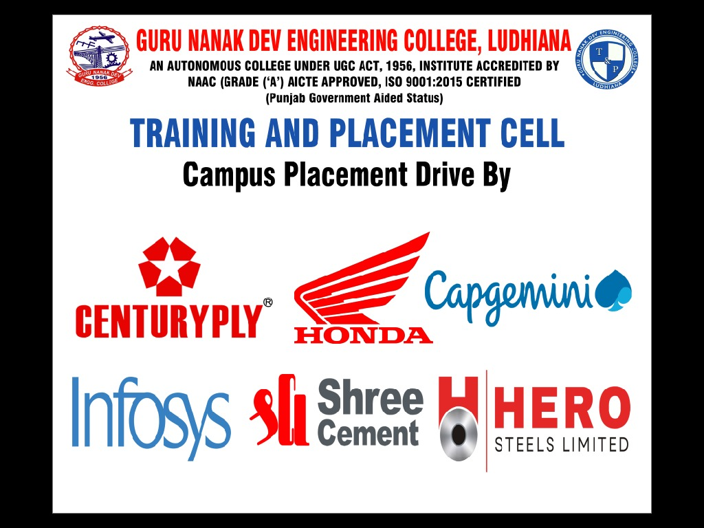
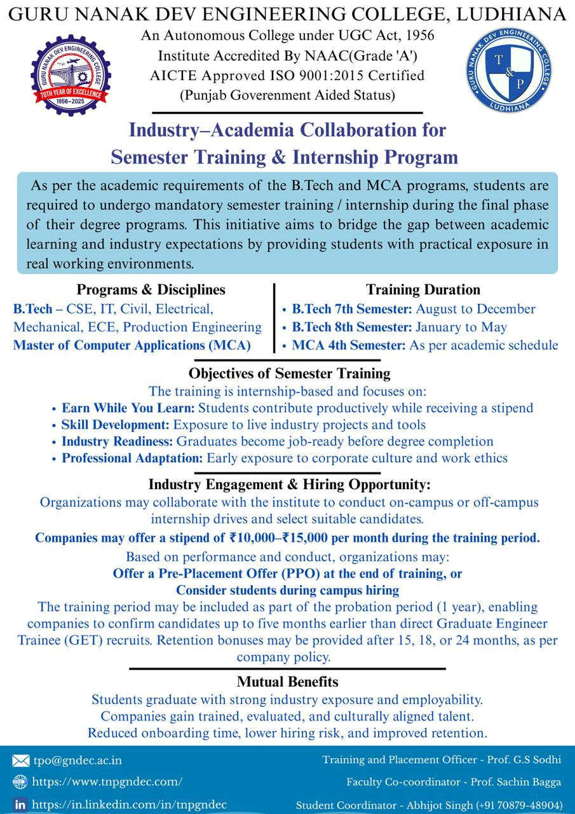
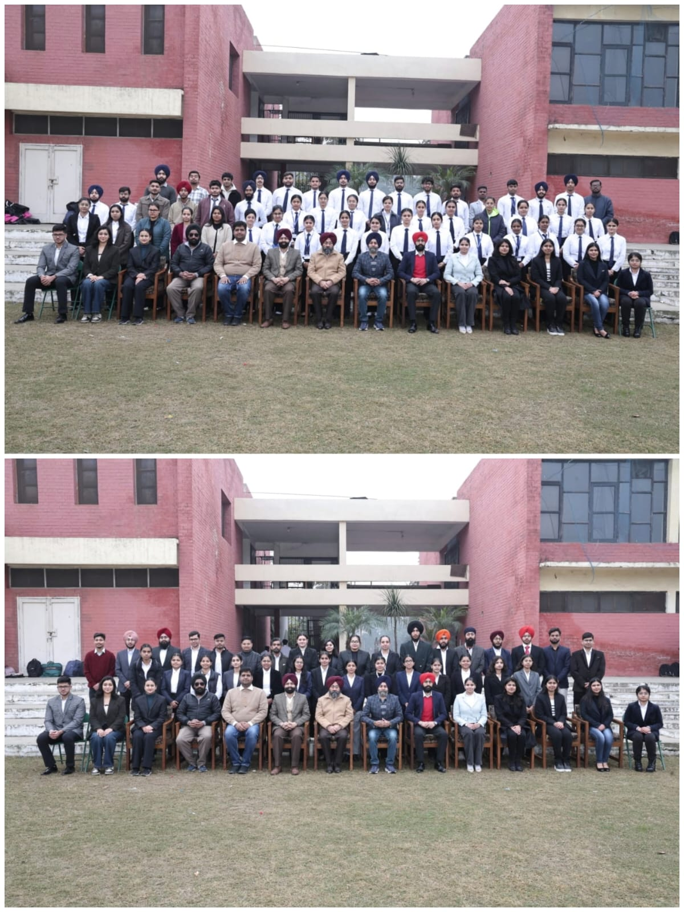

# Training And Placement Cell

The Training and Placement Cell of Guru Nanak Dev Engineering College (GNDEC), Ludhiana, serves as a vital link between academia and industry, fostering career opportunities for students while addressing the evolving needs of the professional world. Dedicated to enhancing employability and ensuring holistic development, the cell organizes pre-placement training programs, expert lectures, and industry interactions to equip students with the skills and confidence required for their professional journey. With a strong network of esteemed recruiters, GNDEC's Training and Placement Cell consistently facilitates internships and placements across diverse sectors, ensuring a bright future for its graduates.    

---

## Message from TPO's Desk:  Prof. G.S.Sodhi

    

At Guru Nanak Dev Engineering College, Ludhiana, we are committed to empowering students with the skills, knowledge, and confidence needed to succeed in the professional world. Our Training and Placement Cell consistently works to bridge the gap between academia and industry, preparing students for the evolving demands of modern workplaces.

The recent placement season reflects the collective dedication of our students, faculty, and recruiters. Renowned organizations across various sectors have recognized GNDEC’s talent, offering rewarding career opportunities. Our emphasis on technical training, soft skills development, and real-world exposure has played a key role in achieving excellent placement results.

I sincerely thank our recruiting partners for their continued trust and support. To our students, I encourage you to aim high, keep learning, and make the most of every opportunity as we continue to uphold the proud legacy of GNDEC.

 

## Training and Placement Activity Report 

Despite the challenges posed by the global recession and overall industry slowdown, the college administration and the Training & Placement Cell worked proactively to attract reputed companies across diverse sectors, ensuring that students continued to receive strong placement and internship opportunities. Through persistent outreach, strengthened industry relationships, and continuous student skill development, the institution successfully secured remarkable placement outcomes, enabling students to gain maximum benefit even in a highly competitive job market.
    
The Training and Placement Cell proudly present an excellent placement season for the 2024 and 2025 pass-out batches, marked by strong industry participation, diverse job profiles, and competitive packages across IT, non-IT, and core engineering domains. Students secured outstanding opportunities in leading companies, with several premium recruiters. Trident Group offered packages of ₹12 LPA, followed by Josh Technology Group at ₹11.3 LPA. Tata Consultancy Services (Prime) extended offers of ₹9 LPA, while companies such as Argusoft and Stylumia continued their consistent hiring trend by offering packages of ₹7.12 LPA and ₹7 LPA, respectively. TCS Digital also recruited students with packages ranging between ₹7–7.6 LPA, reflecting the strong demand for the college’s skilled talent pool. UltraTech Cement and SML ISUZU Ltd. offered packages of ₹6.5–6.7 LPA, whereas Larsen & Toubro Ltd., 75way Technologies, Vodafone Idea, Nebero Systems, and Cargill extended competitive offers in the ₹6–5.66 LPA range.

Several reputed companies, including Airtel, JMAN Group, KPMG, BizMerlin HR, ShortHill Tech, Kent RO, and Niva Bupa, hired students at attractive packages ranging between ₹5.57–4.62 LPA, demonstrating the diverse opportunities available across technology, consulting, telecom, and engineering domains. The college also witnessed significant hiring from core and infrastructure companies such as Shapoorji Pallonji & Co. Ltd., Mapei, Mahindra & Mahindra Ltd., and Mahindra Swaraj, with offers in the ₹4.2–4.25 LPA bracket. Major IT companies including Capgemini, SafeAeon Inc., Cognizant (GenC Next, GenC Pro, GenC Select), Antier Solutions, Mehta Hi-Tech Industries, and Kion Group provided opportunities in the ₹4 LPA segment.

A broad range of companies offered packages in the ₹3.6–3.75 LPA category, including IndiaMART InterMESH, Infosys, eNest Technologies, HomeKraft Infra, RDC Concrete Limited, and Wits Innovation Lab, indicating strong hiring momentum across both IT services and core sectors. Additional recruiters such as Agile Capital Services, House of Aarch 6, Prime Steel, Ralson Ltd., Arora Iron & Steel Rolling Mills, Consort Builders Pvt. Ltd., GNA Auto Enterprise, and Guru Nanak Auto Enterprises also offered promising roles in the ₹3.24–3.45 LPA range. Companies such as Bharat Bijlee Limited, Booking Koala, and ITL (Sonalika) continued to contribute significantly by offering roles at ₹3 LPA, adding to the overall placement volume.

The Training and Placement Cell has also placed a strong emphasis on skill-building and experiential learning, enabling students to gain hands-on exposure through a wide range of paid internships across reputed companies and national institutions. Several organizations offered attractive stipends, with companies such as Airtel, SML ISUZU Ltd., Pearce Services Global, Venture Pact, GlowLogics Solutions, RDC Concrete, and 75way Technologies providing stipends in the range of ₹20,000–30,000 per month, giving students valuable industry experience. Many engineering and technology firms, including Kion Group-Dematic, SafeAeon Inc., Modern Automotives, Nebero Systems, Iotasol Technologies, Genius Masters, Cropsly, Vinayak International, WITS Innovation Lab, and MeritHub Technologies, offered internships with monthly stipends between ₹10,000–18,000, ensuring students received practical training aligned with their domain skills. Companies from the core and manufacturing sectors such as Dolfin Rubbers Ltd., Eastman Exports & Impex, Gold Stone International, Kangaro Industries, Hero Ecotech, Ralson (India) Ltd., Consort Builders Pvt. Ltd., Rama Steel Forge, and Krittya supported students with stipends in the ₹5,000–15,000 range, contributing to strong industry exposure in mechanical, civil, and production domains. Internships were also facilitated with organizations like Booking Koala, Automation Systems, eNest Technologies, Fundsroom, FundsAudit, and Byteoski Developers, offering stipends from ₹2,000 to ₹10,000.

In addition to corporate internships, students also gained prestigious research opportunities under the AICTE Samarthan Internship Programme, securing positions at IIT Gandhinagar, IIIT Guwahati, NIT Meghalaya, IIIT Una, and NITTTR Chandigarh, working on advanced topics such as Quantum Computing, Cyber-Physical Systems, Robotics, Computational Fluid Dynamics, Solar Thermal Collectors, Networking, Control Systems, and Signal Processing. These extensive internship engagements reflect the institution’s unwavering commitment to enhancing student competencies, improving industry readiness, and fostering an environment of practical, project-based learning.

 

---

## 📊 Placement Snapshot 2024–2025

| Metric | Details |
|------|---------|
| Highest Package Offered | ₹12 LPA (Trident Group) |
| Top Recruiters | Trident Group, Josh Technology Group, TCS, Argusoft, Stylumia, UltraTech Cement, Larsen & Toubro |
| Premium Offers | ₹9 LPA (TCS Prime), ₹11.3 LPA (Josh Technology Group) |
| Major IT Recruiters | TCS, Cognizant, Capgemini, Infosys, Argusoft, Stylumia |
| Core Sector Recruiters | UltraTech Cement, SML ISUZU Ltd., Larsen & Toubro Ltd., Mahindra & Mahindra Ltd. |
| Internship Stipend Range | ₹2,000 – ₹30,000 per month |
| Research Internship Institutes | IIT Gandhinagar, IIIT Guwahati, NIT Meghalaya, IIIT Una, NITTTR Chandigarh |

---

## Major Recruiters

\

---\

---\

---\

---\

---
\

---
\

---
\

---
\

---

 

---

## Invitation for Placements and Internships

\

---
\

\

## Training And Placement Student team

\

---

Guru Nanak Dev Engineering College also has an active training and placement cell in order to assist our students in identifying their ambitions and life goals in the trending competitive placement market. T&P provides the infrastructural facilities to conduct group discussions, tests and interviews besides catering to other logistics.

The Training & Placement Cell was applauded for its efforts and achievements by a national daily.

We have a training placement team which includes Student Coordinators, Deputy Coordinators, Co-coordinators, Student moderators, Student Advisor, Database head Administrator, Public relation officer, Media Head, Executive Team, Who perform their duties well and efficiently.
  

---

## Placement Insights

| Company Name                                     | Package(LPA)          |
|------------------------------------------------|-----------------------|
| TCS Prime                                        | 9                    |
| Argusoft                                         | 7.12                 |
| Stylumia Intelligence Technology Pvt. Ltd.       | 7                    |
| TCS (Digital)                                    | 7                    |
| Ultra Tech Cement Ltd                            | 6.5                  |
| 75way Technologies Pvt. Ltd.                     | 6                    |
| Larsen & Toubro Limited                          | 6                    |
| Nebero Systems Private Limited                   | 6                    |
| Vodafone Idea                                    | 6                    |
| Cargill                                          | 5.66                 |
| Airtel                                           | 5.57                 |
| SRVA Education                                   | 5.46                 |
| JMAN Group                                       | 5                    |
| KPMG                                             | 5                    |
| Kent RO                                          | 4.8                  |
| ShortHill Tech                                   | 4.8                  |
| BizMerlin HR.                                    | 4.82                 |
| Shapoorji Palloni & Co, Ltd                      | 4.25                 |
| Mahindra & Mahindra Ltd.                         | 4.2                  |
| SafeAeon Inc.                                    | 4.2                  |
| Capgemini                                        | 4                    |
| Cognizant                                        | 4                    |
| Kion Group-Dematic                               | 4                    |
| Corizo                                           | 4                    |
| IndiaMart IndiaMesh Ltd.                         | 3.6                  |
| Amber Enterprises                                | 3.5                  |
| WITS INNOVATION LAB                              | 3.5                  |
| Vardhman Special Steels Ltd.                     | 3.38                 |
| RDC Concrete (India) Pvt. Ltd.                   | 3.36                 |
| TCS (Ninja)                                      | 3.36                 |
| Consort Builders Pvt. Ltd.                       | 3.24                 |
| Ralson (India) Limited                           | 3.24                 |
| Zydex Industries Private Limited                 | 3.2                  |
| Spectrum Automation & Controls                   | 3.18                 |
| Continental Engineering Consultants              | 3                    |
| Genius Masters                                   | 3                    |
| Happy Forgings Limited                           | 3                    |
| International Tractors Limited                   | 3                    |
| NUHOME FURNISHINGS                               | 3                    |
| Pearce Services Global, Mohali                   | 3                    |
| Ultafine                                         | 3                    |
| HMC E-Valley Pvt. Ltd.                           | 2.64                 |
| NAHAR INDUSTRIAL ENTERPRISES LIMITED             | 2.64                 |
| Brosis International                             | 2.64                 |
| Freeman Group                                    | 2.58                 |
| Hero Ecotech                                     | 2.52                 |
| DNK Chemicals & Coatings Pvt. Ltd.               | 2.5                  |
| Volkswagen Lally Motors Ludhiana                 | 2.4                  |
| AlphaNumeric Ideas Pvt. Ltd                      | 2.4                  |
| Spectrum Talent Management Limited               | 2.4                   |
| Relinns Technologies Pvt. Ltd.                   | 2.31                 |
| New Era Machines                                 | 2.3                  |
| Deepak Fasteners                                 | 2.16                 |
| Rama Steel Forge Ludhiana                        | 2.16                 |

## [Placement Highlights 2025](Placement_highlights_2023.md)

---

## [Glimpses](Glimpses.md)

---

## Events

<!-- - [Events held in collaboration with Mahindra & Mahindra](Events_MM.md) -->

- [Events held in collaboration with Infosys](Events_Axis_Bank.md)

- [Industry Engagement and Student Development Activities – 2025](Events_2025.md)
- [Current Placement Activities](https://www.tnpgndec.com/)
- 
